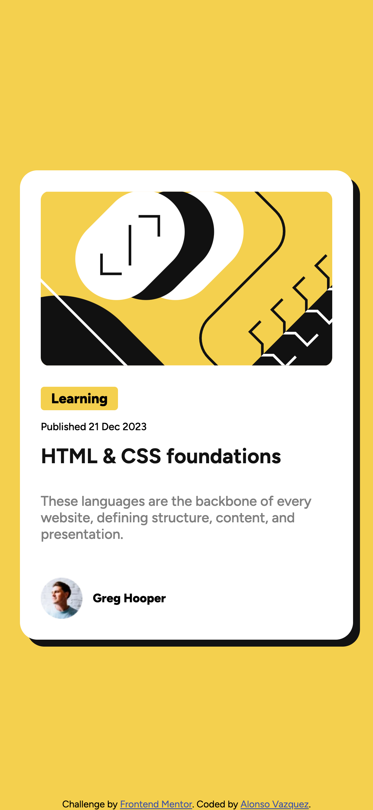

# Frontend Mentor - Blog preview card solution

This is a solution to the [Blog preview card challenge on Frontend Mentor](https://www.frontendmentor.io/challenges/blog-preview-card-ckPaj01IcS). Frontend Mentor challenges help you improve your coding skills by building realistic projects. 

## Table of contents

- [Overview](#overview)
  - [The challenge](#the-challenge)
  - [Screenshot](#screenshot)
  - [Links](#links)
- [My process](#my-process)
  - [Built with](#built-with)
  - [What I learned](#what-i-learned)
  - [Continued development](#continued-development)
- [Author](#author)

## Overview

### The challenge

Users should be able to:

- See hover and focus states for all interactive elements on the page

### Screenshot

### Links

- Solution URL: [Add solution URL here](https://your-solution-url.com)
- Live Site URL: [Add live site URL here](https://your-live-site-url.com)

## My process

### Built with

- Semantic HTML5 markup
- CSS custom properties
- Flexbox
- Mobile-first workflow

### What I learned

This being my sixth solution I learned to structure my CSS file faster, add the basic reset styles from scratch (and no need to look up on internet :D ).

Also, I'm starting to get use to use "*em*" instead of "*px*" and also thinking more about semantic HTML for accessibility. I'm forcing myself to start on mobile first workflow.

### Continued development

I'd like to improve this by removing some classes and just focus on "main" classes and style them down by HTML elements or start digging a bit more into BEM methodology.

## Author

- Website - [Alonso Vazquez](https://github.com/alonsovzqz)
- Frontend Mentor - [@alonsovzqz](https://www.frontendmentor.io/profile/alonsovzqz)

